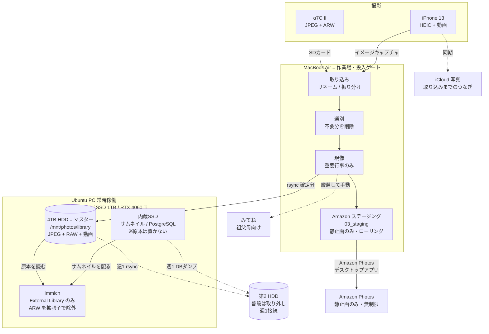

# 写真・動画 管理／閲覧環境 提案書

作成日: 2026-08-23 / 対象: `docs/requirements.md`

---

## 0. 結論（サマリ）

| 役割 | 担当 | 中身 |
|---|---|---|
| **作業場（選別・現像・投入ゲート）** | MacBook Air | SDカード取り込み → 選別 → 現像 → 確定分だけを下流へ流す |
| **マスター（正）** | **4TB HDD**（Ubuntu 直結）`/mnt/photos/library` | JPEG / RAW / 動画すべての正本。ここが「唯一の真実」 |
| **閲覧** | Ubuntu PC 上の Immich (Docker) | マスターを**外部ライブラリ**として参照。**RAW を除外パターンで非表示**にして「JPEG と RAW が二重に見える」問題を根絶 |
| **Immich の作業データ** | Ubuntu PC 内蔵 SSD (1TB) | サムネイル・エンコード済み動画・PostgreSQL。**原本は置かない**（§5.2 の理由） |
| **バックアップ①（ローカル）** | 第2 HDD（**普段は取り外し・週1接続**） | 原本は rsync ミラー（素のファイル）、DB は日次ダンプ＋世代保持（§4.5） |
| **バックアップ②（オフサイト）** | Amazon Photos | 静止画（JPEG＋RAW）のみ。Mac 上のローリング・ステージング経由でアップロード |
| **祖父母への共有** | みてね を継続 | Immich は自分用の閲覧環境として棲み分け（理由は §6） |
| **iPhone** | Mac 経由に統一 | Immich・Amazon の自動保存はすべて無効。iCloud は「取り込みまでのつなぎ」（§4.7） |

**設計の核となる3つの判断**

1. **Immich には RAW を登録しない。** 「Amazon Photos で JPG と RAW が両方出て見づらい」という課題は、Immich の外部ライブラリの除外パターン `**/RAW/**` を使えば**スタック機能に頼らず確実に**解決できます。Amazon Photos 側は「見るための場所」ではなく「災害時の保険」と割り切ります。
2. **Amazon Photos へのアップロードは Mac の公式アプリ経由が唯一の選択肢。** Amazon は第三者 API を停止しており、rclone 等で Ubuntu から直接送る道は塞がっています。よって「Mac を通過するタイミングでアップロードする」ワークフローに寄せます。
3. **マスターを HDD に置く以上、第2 HDD が要ります。** 4TB HDD 1台では動画のコピーが1つだけになり、**ディスク1台の故障で全損**します。火災や盗難より起こりやすい、最も平凡な故障モードです。§7.1 で正面から扱います。
4. **iPhone を Mac 経由に統一した結果、新しい穴が開きます。** 自動保存をすべて切ると、Mac に取り込むまで iPhone 本体が唯一のコピーになります。iCloud 写真をつなぎとして併用するか、取り込み頻度を上げるかが必要です（§4.7、§12 Q9）。

### 0.1 決定事項（2026-08-23 ヒアリング済み）

| 論点 | 決定 |
|---|---|
| 写真・動画の保管場所 | **4TB HDD をマスター（正本）にする**。Ubuntu 内蔵ディスクには原本を置かない |
| 4TB HDD の接続先 | **Ubuntu 直結**（常時マウント） |
| 祖父母への共有 | **みてねを継続**。Immich は自分用の閲覧環境として運用し、使い勝手が分かってから共有の是非を再検討 |
| 動画のオフサイトバックアップ | **当面は見送り**（リスク受容。§7.2 参照）。ただし §12 Q1 の結論次第で再検討が必要 |
| RAW 現像ソフト | **まず darktable（無料）** で試し、UI がストレスなら Lightroom Classic を検討 |
| フォルダ粒度 | **月毎**（`2026-07/`）＋大イベントのみ独立（`2026-08_okinawa/`）。中は機器別（`a7c2` / `iphone13` / `edited`） |
| iPhone の経路 | **Mac 経由に統一。** Immich・Amazon Photos の自動保存はすべて無効 |
| 第2 HDD | **購入する。** 普段は取り外し、週1接続 |

Codex 案との差分整理と、そこから導いた改善案は `docs/diff_codex_claude_by_claude.md` にまとめています。未確定の論点は §12 に残しています。

---

## 1. 要件の整理と、置いた仮定

### 1.1 要件 → 設計への反映

| 要件 | 設計への反映 |
|---|---|
| HDD(4TB) には画像＋動画、Amazon Photos には画像のみ | HDD = **マスター（正本）** / Amazon = 静止画のみ、Mac のステージング経由でアップロード |
| カメラは Sony α7C II | 33MP・シングル SD スロット。ロスレス圧縮 RAW で約 40〜45MB/枚、JPEG X.FINE で 15〜25MB/枚を容量見積りの前提に |
| iPhone 13 の画像・動画も | **Mac 経由に統一。** 自動保存はすべて無効にし、イメージキャプチャで取り込んで選別してから HDD へ（§4.7） |
| Mac で不要写真を削除してからバックアップ | Mac を「投入ゲート」に位置づけ。**Mac を通っていないものは下流に存在しない**という一方向フローを徹底 |
| JPG と RAW の両方をバックアップ | 同じフォルダに同名で並べる。Immich での非表示は**拡張子ベースの除外**で実現（§5.3）。Amazon への選別は Mac 側ステージングで制御 |
| 基本は撮って出し、重要行事のみ Mac で現像 | 現像成果物は `edited/` 配下に `_edit` サフィックスで格納 → 自動的に Immich にも Amazon にも載る |
| Ubuntu PC (常時稼働) で Immich | Immich = 閲覧レイヤ。ファイルの正本管理は Immich に委ねず、素のディレクトリツリーで保持（可搬性・将来の乗り換え耐性） |
| 子供の写真が主用途 / 祖父母に「みてね」で公開 | §6 で みてね継続を推奨。乗り換えコストの負担者が「自分」ではなく「祖父母」である点を重視 |

### 1.2 確定情報

**Ubuntu PC**: Core i5 / メモリ 32GB / SSD 1TB / **RTX 4060 Ti 16GB**

- メモリ 32GB は Immich 推奨（8GB RAM / 4コア）を大きく超えます。制約になりません
- SSD 1TB は、サムネイル等の派生データ（原本の 3〜20% 程度）＋ PostgreSQL に十分
- **RTX 4060 Ti は活用します**（§5.6）。CLIP による画像検索と顔認識、動画トランスコードが桁違いに速くなります。子供の写真が主用途なら顔認識の質と速度は体感に直結します
- 主 HDD のファイルシステムは **ext4** を第一候補とします（Immich は NTFS/FAT32 非対応）

### 1.3 置いた仮定（違っていたら §12 でご指摘ください）

- Amazon プライム会員である（静止画無制限の条件）。
- 撮影量は年間 2,000〜4,000 枚（残す枚数）、動画は年間 100〜300GB 程度。
- 4TB HDD は現時点で空、または初期化してよい。

---

## 2. 全体構成



**データの流れは一方向**です。Mac から下流（HDD / Amazon）へは流れますが、逆流はありません。これにより「Mac で消したのに HDD に残っている」という事故を構造的に防ぎます。

**カメラも iPhone も、すべて Mac を通ります。** iPhone の自動バックアップ経路を廃止したことで例外がなくなり、「Mac で選別したものだけが下流に存在する」というルールが全メディアに適用されます。唯一の例外が iCloud ですが、これは iPhone のミラー（同期）であって保管先ではないため、選別後に iPhone から削除すれば追随して消えます。

---

## 3. ディレクトリ設計

### 3.1 マスター（4TB HDD: `/mnt/photos/library`）

**月毎フォルダを基本とし、大きなイベントのみ独立フォルダを作ります。**

```
/mnt/photos/library/
├── 2026/
│   ├── 2026-07/                    ← 通常の月
│   │   ├── a7c2/
│   │   │   ├── 20260703_101203_DSC04521.ARW
│   │   │   ├── 20260703_101203_DSC04521.JPG
│   │   │   └── 20260703_101203_DSC04521.ARW.xmp   ← darktable の現像パラメータ
│   │   ├── iphone13/
│   │   │   ├── 20260705_143355_IMG_0912.HEIC
│   │   │   └── 20260705_143355_IMG_0912.MOV        ← Live Photo の動画部
│   │   └── edited/
│   │       └── 20260703_101203_DSC04521_edit.JPG
│   ├── 2026-08/
│   └── 2026-08_okinawa/            ← 大イベントのみ独立
│       ├── a7c2/
│       ├── iphone13/
│       └── edited/
└── 2027/
```

**設計意図**

- **粒度は月毎。** 日毎＋イベント名は運用負荷が高すぎます。Immich のタイムラインは EXIF 撮影日時で並ぶため、フォルダの粒度は表示順に一切影響しません（詳細は §5.7）
- **大イベントフォルダも `YYYY-MM_` プレフィックスを維持する。** `okinawa/` ではなく `2026-08_okinawa/` にすることで、Immich のフォルダビューでも Finder でも時系列ソートが崩れません
- **機器別サブフォルダ（`a7c2` / `iphone13` / `edited`）。** ファイル名の衝突回避、現像成果物の区別、`edited/` だけを別途扱いたい場面で効きます。数が固定なので `photo-manager import` が自動生成すれば運用負荷はゼロです
- **JPEG と RAW を同じフォルダに置く。** Immich の RAW 除外は拡張子ベース（§5.3）なので、メディア種別で分ける必要がありません。同じフォルダにあるほうが、選別・現像時にペアを目で確認でき、兄弟ファイル同期も同一ディレクトリ内で完結します
- **ファイル名先頭に撮影日時**（`YYYYMMDD_HHMMSS_元ファイル名`）。月毎フォルダには複数日が混ざるため、名前順＝時系列になる効果が大きくなります。カメラの連番リセットによる衝突も防げます

**運用ルール**

- **月をまたぐ旅行は開始月に寄せる。** 8/30〜9/2 の旅行なら `2026-08_okinawa/`
- **「大イベント」の判断基準**: 泊まりを伴う旅行 / 七五三・入園式などの行事 / 後から「あのときの写真」とフォルダ名で探したくなるもの。**迷ったら月毎フォルダに入れる**（分けすぎるほうが後で困ります）
- **HDD へコピーした後は、絶対に移動・改名しない。** Immich は移動を「別アセットの出現＋旧アセットの消失」として扱うため、アルバム・人物のひも付けが失われます。構成の変更はコピー前に済ませます

### 3.2 Mac 側の作業ディレクトリ

```
~/Pictures/PhotoWork/
├── 01_inbox/      SDカード・iPhone から取り込んだ直後（未選別）
├── 02_working/    選別済み・現像中
└── 03_staging/    確定済み。Amazon Photos アプリのバックアップ対象はここ
    └── 2026/2026-07/{a7c2,iphone13,edited}/
```

`03_staging/` には**動画を置きません**（Amazon の動画枠は 5GB のため）。`photo-manager publish` が静止画（ARW / JPG / HEIC）だけを配置し、`.MOV` `.MP4` は除外します。

HDD への rsync 完了かつ Amazon へのアップロード完了を確認したものから、古い順に削除していきます（ローリング運用）。MacBook Air の空き容量に応じて「直近3ヶ月分だけ残す」といった運用にします。

### 3.3 Ubuntu 内蔵 SSD の役割

内蔵 SSD には**原本を1枚も置きません**。Immich の作業データだけを置きます。

```
/srv/immich/                ← 内蔵SSD (1TB)
├── postgres/               PostgreSQL（アルバム・顔認識・お気に入り）
├── thumbs/                 サムネイル・プレビュー（頻繁に読まれる）
├── encoded-video/          Web再生用にトランスコードした動画
├── model-cache/            機械学習モデル
└── profile/
```

**`upload/` は空のままになります。** iPhone を Mac 経由に変更したこと（§4.7）で Immich へのアップロードが一切発生せず、全アセットが External Library 一本になるためです。これにより Immich は完全な read-only 運用になります。

この分離が効く理由は §5.2 に書きましたが、要点は「**HDD にはブラウジング中ほぼアクセスしない**」ことです。タイムラインをスクロールしている間、Immich が読むのは SSD 上のサムネイルだけで、HDD が回るのは原寸表示やダウンロードのときだけです。HDD をマスターにしても閲覧が遅くならないのは、この構成のおかげです。

---

---

## 4. ワークフロー詳細

### 4.1 取り込み（カメラ・iPhone → Mac）

1. SD カードを Mac に接続（iPhone は §4.7 のとおり**イメージキャプチャ**を使用）
2. `photo-manager import`（§9 で自作を提案）が以下を実行
   - EXIF 撮影日時を読んで `YYYYMMDD_HHMMSS_元名` にリネーム（`exiftool` を利用）
   - 撮影月から `01_inbox/YYYY/YYYY-MM/` を生成し、機器別サブフォルダ（`a7c2` / `iphone13`）へ振り分け
   - 兄弟ファイル（`.ARW` / `.JPG` / `.ARW.xmp` / Live Photo の `.MOV`）を1トランザクションで改名
   - SHA-256 を記録（後の整合性検証用）
   - 既に取り込み済みのファイルはスキップ（重複防止）
3. 大イベントの場合は、この時点で `2026-08_okinawa/` のようにフォルダ名を決めます。**HDD へコピーした後の改名は禁止**（§3.1）なので、判断はここで済ませます
4. **SD カードはこの時点ではフォーマットしない。** HDD への転送完了まで、SD カードが「もう1つのコピー」として機能します。α7C II はシングルスロットのため、カード故障＝全損のリスクがあります。撮影後はなるべく早く取り込む運用を推奨します
5. **iPhone の原本も、HDD と Amazon への保存を確認するまで削除しない**

### 4.2 選別

- `01_inbox/` の **JPEG / HEIC だけ**を見て選別します（RAW は見ない）。撮って出し中心の運用なので、これで十分かつ高速です。
- 不要な静止画を削除 → `photo-manager cull` が**対応する兄弟ファイルを同時に削除**（`.ARW` / `.ARW.xmp` / Live Photo の `.MOV`）。
- 「JPEG を消したが RAW は残したい」ケースはほぼ無いはずですが、保険として削除は即時ではなく `.trash/` への移動にし、一定期間後に消す方式にします。
- **一括削除は必ず少数で挙動を確認してから。** ツールによって RAW+JPEG ペアの扱いが異なります。最初の運用では10組程度でテストします。
- ツール候補は §8。まずは Finder のギャラリー表示 / Quick Look で始め、速度に不満が出たら FastRawViewer 等を検討で十分です。

### 4.3 現像（重要行事のみ）

- 選別後、現像したいカットだけを現像ソフトへ。
- 書き出し先は同じ月フォルダの `edited/` 配下、ファイル名は `＜元名＞_edit.JPG`（フル解像度・sRGB）。
- 現像パラメータは XMP サイドカーとして RAW と同じフォルダに保存（ソフトのカタログDBに閉じ込めない ＝ 将来ソフトを乗り換えても再現できる）。darktable のサイドカーは `元ファイル名.ARW.xmp` という二重拡張子になります。
- **darktable の現像結果を Immich が再現するわけではありません。** 家族に見せたい完成状態は必ず JPEG へ書き出してください。
- `_edit` 付きが Immich にも Amazon にも自動で載ります。撮って出し版と現像版が両方 Immich のタイムラインに並びますが、ファイル名が隣接するため実用上の問題は小さいと判断しました。気になる場合は Immich のスタック機能で手動束ねが可能です。

### 4.4 マスター（HDD）への確定転送

```bash
rsync -avh --progress --checksum \
  ~/Pictures/PhotoWork/02_working/2026/ \
  ubuntu:/mnt/photos/library/2026/
```

- SSH 鍵認証で行い、`photo-manager publish` としてラップします。
- **転送は rsync に寄せます。** SMB のドラッグ&ドロップは、大量ファイルで途中失敗したときに何が転送済みか分からなくなります。SMB 共有は「Mac の Finder から HDD の中身を目視確認する」用途に別途用意します（§8.3）。
- 転送後にファイル数・合計容量を照合します。`--checksum` を付ければ内容まで検証できます（初回や重要イベントのみでも可）。
- **コピーが完全に終わってから** Immich の「ライブラリをスキャン」を API 経由でキック（`POST /api/libraries/{id}/scan`）。コピー途中のフォルダを取り込ませないためです。
- 転送成功後、`02_working/` の中身を `03_staging/` へ移動（**静止画のみ**。`.MOV` `.MP4` は除外）。

### 4.5 バックアップ（第2 HDD）

**第2 HDD は普段取り外しておき、週1回だけ接続します。** 常時接続のディスクは、誤削除・ランサムウェア・電源障害でマスターと同時にやられます。バックアップを名乗るなら物理的に切り離せる状態にすべきです。

#### 方式: 原本は rsync ミラー、変化するものは世代保持

データの性質で使い分けます。

| データ | 性質 | 方式 |
|---|---|---|
| 写真・動画の原本 | **追記のみ。一度置いたら変更されない** | **rsync ミラー**（素のファイルのまま） |
| XMP サイドカー | 現像のたびに更新される | rsync ＋ `--backup-dir` で世代退避 |
| Immich PostgreSQL | 毎日変わる | 日次ダンプ＋7世代保持 |
| docker-compose / `.env` | 稀に変わる | 同上（`.env` は秘密情報としてアクセス制限） |

**原本に restic のようなバックアップ専用ツールを使わない理由**は、原本が「追記のみ」だからです。履歴管理・重複排除といった主価値がほとんど効かない一方、「復元にそのツールが必要」という依存だけが残ります。**10年後に家族の誰かが HDD を繋いで写真を取り出せる状態でいてほしい**、というのがこのアーカイブの目的です。素のファイルであることの価値を優先します。

ビットロット検出は `photo-manager verify`（SHA-256 照合、§9）で代替します。むしろ自作したほうが、マスターとバックアップの両方を同じ基準で検査できます。

#### スクリプト

```bash
#!/bin/bash
set -euo pipefail
STAMP=$(date +%F)

# 1) 原本 → 第2 HDD（削除分は日付フォルダへ退避）
rsync -a --delete --delete-after \
  --backup --backup-dir="/mnt/backup/.deleted/${STAMP}" \
  /mnt/photos/library/ /mnt/backup/library/

# 2) Immich の DB ダンプ（アルバム・人物・お気に入りはここにしかない）
docker exec immich_postgres pg_dumpall -U postgres \
  | gzip > "/mnt/backup/immich-db/dump_${STAMP}.sql.gz"
ls -1t /mnt/backup/immich-db/dump_*.sql.gz | tail -n +8 | xargs -r rm

# 3) 構成ファイル
rsync -a /srv/immich/docker-compose.yml /srv/immich/.env /mnt/backup/config/

sync
echo "${STAMP}" > /mnt/backup/.last-backup
```

**`--backup-dir` を併用する理由**: `--delete` だけだとマスター側の誤削除がそのままバックアップに伝播し、「バックアップがあるのに戻せない」状態になります。退避分は月1回まとめて削除します。

**サムネイル（`/srv/immich/thumbs`）はバックアップ不要**です。原本と DB があれば Immich が再生成できます。容量も時間も食うので対象から外します。

#### 「繋ぐのを忘れる」対策

手動運用の最大の失敗モードは**やらなくなること**です。人間の仕事を「繋ぐ」だけに減らします。

- **接続を検知して自動実行**する（udev ルール または systemd の `.mount` ユニット）。マウントされたら上のスクリプトが勝手に走る状態にしておく
- `photo-manager status` が `.last-backup` を読み、**最終バックアップから7日を超えたら警告**する
- 週1の固定曜日をカレンダーに繰り返し登録する

#### 復元試験（半年に1回）

**バックアップの最大の失敗モードは「無かった」ではなく「あるつもりだった」です。** 半年に1回、以下を一時領域へ実際に戻します。

1. 任意の月フォルダから写真・動画・XMP を復元し、開けることを確認
2. DB ダンプを別コンテナへリストアし、アルバムと人物が戻ることを確認
3. 所要時間を記録する（本番の障害時に「どれくらいかかるか」を知っておく）

### 4.6 Amazon Photos へのアップロード

**前提となる制約**: Amazon は第三者向け API を停止しており、rclone 等のツールからのアップロードはできません。**公式デスクトップアプリ（Mac/Windows）またはモバイルアプリが唯一の経路**です。Linux 版は存在しないため、Ubuntu から直接送ることはできません。

**手順**

1. Mac に Amazon Photos デスクトップアプリをインストール
2. 「**バックアップ**」機能（「同期」ではない）で `~/Pictures/PhotoWork/03_staging/` を対象に指定
3. `03_staging/` には JPEG と RAW のみを置く（動画は含めない）
4. アップロード完了を確認後、古いものから `03_staging/` を削除してディスクを解放

**必ず事前検証してください（§11）**

1. **「バックアップ」モードでローカル削除がクラウドに伝播しないこと。** 数枚のテストファイルで確認してから本運用に入ってください。「同期」モードではローカル削除が伝播します。ここを取り違えると、ステージングを掃除した瞬間にオフサイトバックアップが消えます
2. **ARW を実際にアップロードし、ダウンロードして開けること。** 「アップロードできた」と「取り出せる」は別の話で、バックアップとして意味があるのは後者だけです。α7C II の ARW、iPhone の HEIC、現像済み JPEG を各数点で確認します
3. **静止画枠として計上されること。** ARW が動画枠（5GB）を消費してしまう報告が過去にあります。数点上げた後にストレージ使用量を確認します

1 の確認が取れない場合は、`03_staging/` を消さずに溜め続ける（＝ Mac の容量を消費し続ける）ことになります。

**運用上の注意**

- **アップロード元を Mac の `03_staging/` に一本化する。** 同じイベントを Mac と iPhone の両方から上げると重複します。Amazon Photos の重複整理機能をあてにしないでください
- **Prime の継続状態を年1回確認する。** Prime 解約や容量超過が続くと、アップロード・共有が制限され、最終的にデータが削除される可能性があります。Amazon Photos を唯一の保管先にはしません（本構成では常に HDD が正本です）

### 4.7 iPhone — Mac 経由に統一

**Immich・Amazon Photos の自動バックアップはすべて無効にします。** 自動保存を有効にすると、Mac で選別する前の不要な写真までアップロードされ、「不要な写真はバックアップさせたくない」という要件と衝突するためです。カメラと同じく、**Mac を通過したものだけが下流に存在する**というルールを iPhone にも適用します。

#### 手順

1. **macOS「イメージキャプチャ」で** `01_inbox/.../iphone13/` へ取り込む
2. Finder / Quick Look / QuickTime Player で選別する
3. 不採用の Live Photo は、静止画と `.MOV` を**両方**削除する（`photo-manager cull` が兄弟ファイルとして扱います）
4. HDD へのコピーと Amazon へのアップロードを確認してから、**iPhone 側の原本を削除する**

**「写真」アプリからの書き出しは使わないでください。** イメージキャプチャは原本をそのまま取り出しますが、「写真」アプリからの書き出しはメタデータが落ちることがあり、後述の Live Photo のペアリングが壊れる可能性があります。

#### Live Photo の扱い（検証済み）

Live Photo は `IMG_0912.HEIC` と `IMG_0912.MOV` の2ファイルで、両方に同じ識別子（`livePhotoCID`）がメタデータとして埋め込まれています。**Immich はこの識別子で照合して1つのアセットに束ねる**ため、External Library でもタイムラインに `.MOV` が二重に並ぶことはありません。

- ペアリングはメタデータ由来なので、**ファイル名を変更しても壊れません**（§4.1 のリネームと両立します）
- 既知バグ①: Immich 上で Live Photo を削除すると HEIC だけ消えて MOV が残る → **本構成は read-only なので影響なし**
- 既知バグ②: 複数ライブラリ間で誤ったペアリングが起きる → **External Library 一本化により影響なし**

Upload Library を廃止したこと（§3.3）が、結果的にこの2つのバグを構造的に回避しています。

#### 【重要】取り込みまでの穴を塞ぐ

自動保存をすべて切ると、**Mac に取り込むまで iPhone 本体が唯一のコピー**になります。週1で取り込む運用なら、最大1週間分の写真が無防備です。子供の写真は毎日撮るものなので、これは常時発生する穴です。**iPhone の紛失・水没・故障は、HDD の故障より確率の高い事象です。**

**対策: iCloud 写真を「取り込むまでのつなぎ」として併用する。**

- 50GB プラン（月130円）で十分。iPhone のミラーとして機能します
- **Amazon Photos の Auto-Save とは性質が違う点が重要です。** Amazon は「ローカルを消してもクラウドに残る」バックアップなので、選別前の写真が永続してしまいます。一方 iCloud は「iPhone と同じ状態を保つ」同期なので、Mac に取り込んで iPhone から削除すれば iCloud からも消えます
- したがって**恒久保管先にはならず、「不要な写真をバックアップさせたくない」という要件に反しません**。最終的な保管先はあくまで HDD と Amazon Photos です

これを入れない場合は、代わりに**取り込み頻度を上げる**（週1ではなく2〜3日に1回）必要があります。どちらかは必要です（§12 Q9）。

#### Immich モバイルアプリの位置づけ

自動バックアップは無効にしますが、**閲覧用としてはインストールします。** 外出先から Tailscale 経由でライブラリを見る、祖父母に見せる、といった用途に使えます。

---

---

## 5. Immich 構成の詳細

### 5.1 ライブラリ方式：外部ライブラリを推奨

Immich には2つの方式があります。

| | 外部ライブラリ（推奨） | アップロードライブラリ |
|---|---|---|
| ファイルの所有者 | 自分（素のディレクトリツリー） | Immich（Storage Template でパス決定） |
| RAW の除外 | **除外パターンで可能** | 不可（登録後にスタックで束ねるのみ） |
| rsync でのバックアップ | 素直 | 可能だが DB との整合が必要 |
| Immich UI からの削除・日付編集 | 不可（`:ro` マウント時） | 可能 |
| 乗り換え耐性 | 高い | 中 |

**本構成では External Library だけを使い、Upload Library は一切使いません。**

当初はハイブリッド（カメラ＝外部、iPhone＝アップロード）を想定していましたが、iPhone を Mac 経由に変更したこと（§4.7）で Immich へのアップロードが一切発生しなくなりました。結果として:

- **Immich が完全な read-only になる。** Immich 側にしか存在しないファイルがゼロになります
- **バックアップ対象が2つだけになる** — `/mnt/photos/library` と PostgreSQL のみ
- **Live Photo の既知バグを構造的に回避できる。** 複数ライブラリ間での誤ペアリングや、削除時の MOV 残留は、いずれも Upload Library との併用時に起きる問題です（§4.7）
- Storage Template の設定が不要になる（§5.4）

Immich が壊れても失うのは**アルバム・人物名・お気に入りだけ**で、それらは DB ダンプから復旧できます。写真そのものは常に素のディレクトリツリーとして手元にあります。

### 5.2 docker compose の要点 — SSD と HDD の役割分担

```yaml
services:
  immich-server:
    volumes:
      # Immich の作業データ = 内蔵SSD（サムネイル・DB・iPhone分）
      - /var/lib/immich:/data
      # マスター = HDD を読み取り専用でマウント
      - /mnt/photos/library:/mnt/media/library:ro
```

**なぜ原本（HDD）と作業データ（SSD）を分けるのか。** Immich はタイムラインの表示に、原本ではなく生成済みのサムネイルを使います。これを SSD に置いておけば、写真を何千枚スクロールしても HDD には一切アクセスが飛びません。HDD が回るのは原寸表示・ダウンロード・動画再生のときだけです。

もし逆に、サムネイルや PostgreSQL まで HDD に置くと、スクロールのたびにランダムリードが発生し、スピンアップ待ちで体感がはっきり悪化します。**「マスターは HDD、作業データは SSD」は、HDD をマスターにするなら必須の分割**だと考えてください。

内蔵 SSD に必要な容量の目安は、サムネイル＋プレビューで**原本の 3〜8% 程度**（4TB 分の原本なら 150〜300GB）、加えて PostgreSQL が数 GB、iPhone のバックアップ分が実測次第です。ここが §12 Q1 で内蔵ディスク容量を伺いたい理由でもあります。

`:ro` を付けることで、Immich の UI からの誤削除を物理的に防ぎます（Immich 側は削除成功と表示するが実際には消えない、という挙動になる点だけ留意）。

### 5.3 ライブラリ設定 — RAW の除外は拡張子ベースで

- インポートパス: `/mnt/media/library`
- **除外パターン**:

```text
**/*.ARW
**/*.arw
**/.trash/**
```

**拡張子ベースにする理由**は、フォルダ構成から独立させるためです。`**/RAW/**` のようなフォルダ依存の除外にすると、フォルダ構成を変えた瞬間に壊れます。月毎フォルダ（§3.1）では RAW と JPEG が同じディレクトリに同居するため、拡張子で判定する以外に方法がありません。

大文字・小文字の両方を書いておきます（macOS は既定で大文字小文字を区別しませんが、Linux 側は区別するため）。

これにより Immich のタイムラインには **JPEG / HEIC / 動画 / 現像済み JPEG だけ**が並びます。Amazon Photos で感じていた「同じ写真が2つ出る」問題は発生しません。

なお Immich 本体には RAW+JPEG の**自動**スタック機能は未実装で、実現するにはコミュニティツール（`immich-stack` 等）や `immich-go` の `--manage-raw-jpeg=StackCoverRaw` が必要です。**除外方式ならこれらを一切導入せずに済む**のが、本提案で除外を選ぶ理由です。

#### スキャン運用

- Mac からのコピーが**完全に終わってから**ライブラリをスキャンする（コピー途中のフォルダを取り込ませない）
- `photo-manager publish` が rsync 完了後に `POST /api/libraries/{id}/scan` をキックする
- 夜間の定期スキャンも有効にしておく
- **Experimental 扱いの自動監視（watching）には依存しない**

### 5.4 Storage Template は使いません

Storage Template は Immich がアップロードを受け取ったときの配置ルールです。**本構成では Immich へのアップロードが一切発生しない**（iPhone も Mac 経由・§4.7）ため、設定不要です。

### 5.5 外部アクセス

- **自分・妻が外出先から見る**: Tailscale を推奨。ポート開放不要、設定が数分、無料枠で十分。
- **共有リンクを他人に渡す**: Tailscale では不可。Cloudflare Tunnel + 独自ドメインが安全な選択肢。ただし自宅サーバーをインターネットに露出させる判断になるため、§6 の結論（みてね継続）を採るなら**当面は不要**です。

### 5.6 GPU アクセラレーション（RTX 4060 Ti 16GB）

**必ず「CPU で動かしてから GPU を足す」順序で導入します。** 最初から GPU 込みで構築すると、問題が起きたときに Immich の設定なのかドライバなのか切り分けられません。

1. CPU のみで Immich の基本動作・検索・サムネイル生成を確認する
2. NVIDIA ドライバーと NVIDIA Container Toolkit を整備する
3. 公式手順に沿って機械学習コンテナを CUDA 版に切り替える（CLIP 検索・顔認識）
4. 必要なら NVENC/NVDEC による動画トランスコードを有効化する
5. 更新後に画像検索と動画再生をテストする

**効果が大きいのは顔認識と CLIP 検索**です。子供の成長記録では「この子の写真だけ」で絞れることの価値が高く、初回の全ライブラリスキャンにかかる時間も桁で変わります。VRAM 16GB あれば、より大きな CLIP モデルへの変更も選択肢に入ります。

動画トランスコードは、閲覧時にブラウザが直接再生できない形式（一部の XAVC S など）に遭遇したときに効きます。必須ではありません。

### 5.7 フォルダビュー

Account Settings → Features → **Folders** で有効化すると、Web とモバイルアプリの両方でファイルエクスプローラのようにフォルダを辿れます。

Immich のタイムラインは EXIF 撮影日時で並ぶため、**フォルダ構成は表示順に一切影響しません**。イベントのまとまりは本来 Immich の**アルバム**で表現するものです。しかしフォルダビューを有効にしておけば、§3.1 のフォルダ構成が「もう一つの導線」として生きます。`2026-08_okinawa/` のような大イベントフォルダは、ここで直接辿れます。

有効化を推奨します。マスターのディレクトリ構造がそのまま Immich 上で見える状態は、「Immich が無くてもファイルを辿れる」という本構成の設計思想とも一致します。

### 5.8 バージョン運用

Immich は 2026年7月時点で v3.1.0。v2.0.0 で「安定版」を宣言し、破壊的変更はメジャーバージョンに限定する方針になっています。

- **`IMMICH_VERSION` はメジャーバージョンを固定する。** `latest` に無条件追従しない
- **サーバーとモバイルアプリのメジャーバージョンを一致させる**（モバイルアプリは現行と1つ前のメジャーに対応）
- 更新前にリリースノート・破壊的変更・DB ダンプ完了を確認する
- 大きな更新後は、ログイン / タイムライン / 検索 / 動画再生 / External Library のスキャンを確認する
- マイナーアップデートは月1回程度まとめて実施する

---

## 6. 祖父母への共有：みてね継続を推奨

| 観点 | みてね | Immich 共有リンク／アカウント |
|---|---|---|
| 祖父母の学習コスト | ゼロ（既に使えている） | **要再学習・要再設定** |
| 通知・コメント・「1秒動画」 | あり（祖父母の利用習慣そのもの） | コメントは可能、自動生成の情緒的機能はなし |
| フォトブック・DVD 等の物理化 | あり | なし |
| 可用性 | 事業者が担保 | **自宅サーバーが落ちれば見えない** |
| 動画の長さ制限 | 無料2〜3分 / プレミアム最大10分 | 制限なし |
| プライバシー | 事業者に預ける | 自宅で完結 |
| 自分の手間 | 選んで送るだけ | サーバー運用＋外部公開の維持 |

**決定: みてねを継続し、Immich は自分用の閲覧・管理環境として棲み分ける。**

理由は、乗り換えコストを負担するのが**自分ではなく祖父母**である点です。祖父母にとって「新しいアプリを入れ直す」「見え方が変わる」は想像以上に大きな負担で、最悪の結果は「見なくなる」ことです。得られるもの（動画の長さ制限の解消、プライバシー）に対して、失うリスクが割に合いません。

また、自宅サーバーの可用性を「祖父母が孫の写真を見られるか」に直結させると、停電・回線障害・アップデート失敗が家庭内の問題に発展します。Immich を趣味として楽しむ余地を残すためにも、クリティカルパスから外しておくほうが健全です。

**将来的な移行余地は残します**: Immich の共有リンクはパスワード・有効期限・ダウンロード可否を設定でき、アカウント不要で閲覧できます。Immich をしばらく運用して使い勝手と安定性を把握できたら、「みてねと並行で共有リンクも送る」→「祖父母の反応を見る」という段階的な移行が可能です。いきなり切り替える必要はありません。

そのため **Phase 2 の時点では外部公開（Cloudflare Tunnel 等）を構築しません**。自分・妻の外出先からのアクセスは Tailscale で足り、自宅サーバーをインターネットに露出させる判断は、共有の必要が実際に生じてからで十分です。

---

## 7. バックアップ戦略の評価と容量見積り

### 7.1 3-2-1 ルールに対する充足状況

**第2 HDD 導入前（＝ Phase 0 の間だけ通る状態）**

| 対象 | コピー数 | メディア種別 | オフサイト | 評価 |
|---|---|---|---|---|
| 静止画（JPEG/RAW） | 2（HDD / Amazon Photos） | 2種 | あり | 許容範囲 |
| **動画** | **1（HDD のみ）** | 1種 | なし | **危険** |
| Immich DB | 1（内蔵SSD のみ） | 1種 | なし | **危険** |

**第2 HDD 導入後（本構成の到達点）**

| 対象 | コピー数 | メディア種別 | オフサイト | 評価 |
|---|---|---|---|---|
| 静止画（JPEG/RAW） | 3（HDD / 第2 HDD / Amazon） | 2種 | あり | **充足** |
| 動画 | 2（HDD / 第2 HDD） | 1種（同一拠点） | なし | 許容（火災・盗難のみ残リスク） |
| Immich DB | 2（SSD / 第2 HDD） | 2種 | なし | 許容 |
| iPhone の未取り込み分 | **1（iPhone 本体のみ）** | 1種 | なし | **要対策（§12 Q9）** |

**ここが本提案で最も重要な論点です。**

前バージョンでは「マスター＝Ubuntu 内蔵、バックアップ＝HDD」で自動的に2コピーが確保されていました。マスターを HDD に移したことで、**動画のコピーが物理的に1つだけ**になります。

受容していただいた「動画のオフサイトなし」というリスクと、これは質が違います。オフサイトが無いリスクは火災・水害・盗難という**滅多に起きない事象**に備えないという判断でした。一方、**ディスク1台しかない状態で備えていないのは「HDD の故障」という、最も平凡でありふれた故障モード**です。外付け HDD の年間故障率は数％、5年スパンで見れば十分に起こりうる範囲で、しかも前触れなく起きます。

子供の動画は撮り直しがききません。**第2 HDD（8TB で 1.5〜2万円程度）は「より安全にするための投資」ではなく、「バックアップと呼べる状態にするための最低条件」です。** Phase 0 で購入を済ませてください。

なお、代替として「HDD 2台を btrfs / ZFS のミラー（RAID1）で組む」構成も考えられますが、**推奨しません**。RAID はディスク故障には強い一方、**誤削除・ランサムウェア・ファイルシステム破損は両ディスクに即座に伝播**します。加えて RAID は常時両方が接続されているため、第2 HDD を物理的に切り離す（§4.5）という最大の防御を放棄することになります。rsync ミラー＋削除分の退避のほうが、家庭用途で実際に起きる事故に対しては有効です。

### 7.2 動画のオフサイト対策（将来の選択肢／現時点では不採用）

| 案 | 概要 | 年間コスト目安 | 手間 |
|---|---|---|---|
| **A. Backblaze B2 / Wasabi 等**（推奨） | 動画のみ rclone で暗号化アップロード。Ubuntu から自動実行可能 | 300GB で年 $20〜25 程度 | 初期設定のみ。以後全自動 |
| B. 2台目の HDD をオフサイト保管 | 実家・職場に置き、数ヶ月ごとに持ち帰って同期 | HDD 実費のみ | 定期的な物理作業が必要 |
| C. Google One 等の汎用クラウド | 動画も含めて丸ごと | 2TB で年 13,000円程度 | Amazon Photos と役割が重複 |

現時点では**いずれも採用せず**、ローカルのみで運用します。ただしこの判断は「ローカルに2コピーある」ことを前提に成立します（§7.1）。第2 HDD を見送る場合、動画は文字通り1コピーになるため、そのときは案Aの採用を再検討してください。将来的に切り替えるなら **案A** が最も現実的です — Ubuntu から rclone で完全自動化でき、暗号化（rclone crypt）すれば事業者に中身を見せずに済み、動画だけに絞れば費用は月数百円です。設定は1〜2時間程度なので、判断を変えたくなった時点で着手すれば間に合います。

### 7.3 容量見積り

前提: 残す静止画 3,000枚/年（JPEG 18MB + ロスレス圧縮 RAW 42MB = 60MB/枚）、動画 200GB/年

| | 年間 | 5年後 | 10年後 |
|---|---|---|---|
| 静止画 | 180GB | 900GB | 1.8TB |
| 動画 | 200GB | 1.0TB | 2.0TB |
| 合計 | 380GB | **1.9TB** | **3.8TB** |

**マスターの 4TB HDD は約10年で満杯**になります。撮影量が想定を上回る場合はもっと早く到達するため、**年1回、実績値で見積りを更新する**ことを推奨します。

2台目のディスクを買うなら、**バックアップ側を 8TB にしておく**のが有利です。理由は2つあります。

1. **§4.5 の削除退避（`--backup-dir`）に余裕が必要**。マスターと同容量だと、退避分でいずれ溢れます。
2. **将来マスターが手狭になったとき、8TB 側をマスターに昇格させ、4TB をバックアップに降格できる**。ディスクを買い足す回数が減ります。

内蔵 SSD 側は、サムネイル用に原本の 3〜8%（4TB 分で 150〜300GB）＋ iPhone バックアップ分を見込んでください（§5.2）。

---

## 8. ツール選定

### 8.1 選別（culling）

| ツール | 費用 | 評価 |
|---|---|---|
| Finder ギャラリー表示 / プレビュー | 無料 | **まずはこれで開始を推奨。** 撮って出し中心なら JPEG を見て消すだけで足りる |
| 「写真」アプリ | 無料 | ライブラリに取り込む前提のため、ファイル管理と二重化しやすい。非推奨 |
| FastRawViewer | 約 $20 買切 | RAW の埋め込みプレビューを高速表示。フォルダベースで動くため本構成と相性が良い |
| Photo Mechanic | 約 $139 | 業務レベルの速度。今回の用途にはオーバースペック |

### 8.2 現像

| ツール | 費用 | 評価 |
|---|---|---|
| **Lightroom Classic**（フォトプラン） | 月 1,180円程度 | **重要行事のみの現像には十分見合う。** XMP サイドカー出力、カタログ非依存の運用が可能。Photoshop も付属 |
| darktable | 無料 | 高機能。UI の学習コストは高め。まず無料で試したい場合の第一候補 |
| RawTherapee | 無料 | ディテール重視。UI は darktable 同様に硬派 |
| Sony Imaging Edge Desktop | 無料 | 純正の色再現。機能は限定的だが「撮って出しに近い色で微調整」なら十分 |
| Capture One | 買切 or サブスク | Sony 機との相性は良いが高価 |

**決定: まず darktable（無料）で開始。** 数回現像してみて UI がストレスなら Lightroom Classic へ移行します。年間1.4万円の判断は、実際の現像頻度が分かってからで遅くありません。

darktable を使う場合の設定上の注意:

- 環境設定で **XMP サイドカーの自動書き出しを有効**にする（`storage` → `write sidecar file for each image`）。これで現像パラメータが `RAW/` 配下に残り、将来 Lightroom 等へ乗り換えても「何をしたか」の記録は失われません。
- darktable は**インポートしたフォルダをそのまま参照**する（ファイルを自分の管理下にコピーしない）ため、§3.2 の作業ディレクトリ構成と素直に噛み合います。
- 書き出し設定で出力先を同イベントの `JPEG/` に、ファイル名を `$(FILE_NAME)_edit` にしておくと、§4.3 の命名規則が自動で満たされます。

### 8.3 同期・転送

| ツール | 用途 |
|---|---|
| **rsync over SSH**（実転送はこれ） | Mac → 主 HDD、主 HDD → 第2 HDD。中断からの再開、`--checksum` 検証、スクリプト化が容易 |
| **SMB 共有**（目視確認用） | Mac の Finder から HDD の中身を直接見る。「あの写真どこだっけ」を確認する用途。**転送には使わない** |
| Syncthing | 常時双方向同期。今回は一方向フローを意図的に設計しているため過剰かつ危険 |
| restic | 履歴・暗号化・整合性検査。**原本には使いません**（§4.5 の理由）。将来クラウドへ動画をバックアップする場合の候補 |
| rclone | Backblaze B2 等への動画バックアップ（§7.2 案A を採る場合） |

---

## 9. 本リポジトリ（photo-manager）で自作するもの

既製ツールで埋まらない「繋ぎ」の部分が、このリポジトリの守備範囲です。

| サブコマンド | 内容 | 優先度 |
|---|---|---|
| `import` | SD カード／iPhone → `01_inbox/YYYY/YYYY-MM/{a7c2,iphone13}/`。EXIF 日時でリネーム、月フォルダと機器別フォルダの自動生成、重複スキップ、SHA-256 記録 | **高** |
| `cull` | 静止画の削除に追随して兄弟ファイルを削除（`.trash/` へ退避）。ARW / JPG / `.ARW.xmp` / Live Photo の MOV を1組として扱う。孤児ファイルの検出 | **高** |
| `publish` | `02_working/` → HDD へ rsync → Immich スキャン API キック → `03_staging/` へ静止画のみ配置 | **高** |
| `verify` | 記録した SHA-256 でマスター／第2 HDD の整合性を照合。ビットロット・サイレント破損の検出 | 中 |
| `status` | 年別枚数・容量、`03_staging/` の滞留状況、**最終バックアップからの経過日数**（7日超で警告）、次にやるべき作業の提示 | 中 |
| `prune-staging` | HDD 転送済みかつ一定日数経過した `03_staging/` を掃除 | 中 |

#### リネーム処理の要件（最重要）

`import` のリネームは、間違えると復旧が難しい処理です。以下を仕様に含めます。

- **兄弟ファイルを1トランザクションで改名する**: `DSC04521.ARW` / `DSC04521.JPG` / `DSC04521.ARW.xmp` を必ず同時に。darktable のサイドカーは `元ファイル名.ARW.xmp` という**二重拡張子**である点に注意
- **Live Photo の MOV も同じベース名に揃える**。ペアリング自体はメタデータ（`livePhotoCID`）由来なので壊れませんが、人間が見て対応が分かるように
- **dry-run で対応表を出力し、目視確認できるようにする**
- **リネームは Mac 上の作業段階でのみ行う。** HDD へコピーした後の改名・移動は禁止（Immich が別アセットとして扱い、アルバム・人物のひも付けが失われます）

実装は Python + `exiftool`（PyExifTool）が現実的です。`src/` と `tests/` が空の状態なので、`import` と `cull` から着手し、テストは実際のサンプルファイル数枚で回すのが早いと思います。

---

## 10. 導入ロードマップ

| Phase | 内容 | 期間目安 |
|---|---|---|
| **0. 検証と測定** | ① Amazon Photos の「バックアップ」モードでローカル削除が伝播しないことを確認 ② ARW をアップロード→**ダウンロードして開けること**を確認 ③ 現在の写真・動画の総容量と年間増加量を測定 ④ 実 RAW/JPEG サイズを実測し §7.3 を更新 ⑤ 第2 HDD の容量を決めて購入 ⑥ RAW+JPEG 10組で darktable の選別・現像・XMP・書き出しをテスト | 2〜3日 |
| **1. 土台** | 主 HDD を ext4 でフォーマットし固定マウント。ディレクトリ構造作成。SSH 鍵と SMB 共有。第2 HDD を接続してバックアップ＋**復元**をテスト | 1〜2日 |
| **2. Immich（CPU）** | docker compose で構築（PostgreSQL は SSD）。テストフォルダを External Library に登録し、**ARW 除外・HEIC・Live Photo のペアリング・動画・現像済み JPEG**を確認。DB バックアップと復元を確認。問題なければ全スキャン。Tailscale（**外部公開はしない**）。フォルダビュー有効化 | 2〜3日 |
| **3. GPU** | NVIDIA ドライバー＋Container Toolkit、CUDA 機械学習を有効化。顔認識と画像検索をテスト | 半日 |
| **4. ワークフロー確立** | 既存写真を新ディレクトリ構造へ移行。iPhone の自動保存をすべて無効化し iCloud を設定。Amazon ステージング運用開始。**手作業で1サイクル通す** | 1週間 |
| **5. 自動化** | `photo-manager` の `import` / `cull` / `publish` を実装。第2 HDD の接続検知による自動バックアップ | 継続 |
| **6. 見直し** | Immich の使い勝手を評価し祖父母共有への活用可否を判断。動画総量を実測してオフサイト対策の要否を再検討。darktable の使用感から現像ソフトを最終決定 | 3〜6ヶ月後 |

**Phase 4 を必ず手作業で1周してから Phase 5 に進む**ことを推奨します。自動化すべき対象が、想像と実際でずれることが多いためです。

**Phase 0 の ③ と ⑤ は最優先**です。第2 HDD の容量決定に必要で、これが決まらないとバックアップ設計が確定しません。

---

---

## 11. リスクと要検証事項

| # | 項目 | 影響度 | 対応 |
|---|---|---|---|
| 1 | Amazon Photos「バックアップ」でのローカル削除がクラウドに伝播するか | **致命的** | Phase 0 でテストファイル数枚を使って必ず検証 |
| 2 | **マスター HDD が唯一のコピー（動画）** | **致命的** | 第2 HDD の導入（§7.1）。**未決の間は、動画は HDD 1台の故障で全損します** |
| 3 | **iPhone 取り込み前の写真が iPhone 本体のみ** | **高** | iCloud 写真（50GB / 月130円）を「取り込みまでのつなぎ」として併用、または取り込み頻度を上げる（§4.7、§12 Q9） |
| 4 | ARW が Amazon Photos から取り出せない／動画枠を消費する | 高 | Phase 0 でアップロード後に**ダウンロードして開けること**と、静止画枠として計上されることを確認 |
| 5 | 動画のオフサイトコピーが存在しない | 高 | **リスク受容と決定。** 失いたくない動画は必ずみてねにも上げる／同時故障要因を年1回点検／動画総量 500GB 到達時に再判断（§7.2） |
| 6 | Immich DB のバックアップ漏れ | 高 | §4.5 のスクリプトで rsync と pg_dumpall を必ずセット実行。**復元試験を半年に1回** |
| 7 | バックアップはあるが復元できない | 高 | 半年に1回の復元試験（§4.5）。所要時間も記録する |
| 8 | 第2 HDD を繋ぐのを忘れる | 高 | 接続検知による自動実行＋`photo-manager status` の経過日数警告（§4.5） |
| 9 | α7C II のシングル SD スロット（カード故障＝全損） | 高 | 撮影後の早期取り込み。重要行事は撮影中にこまめにカード交換 |
| 10 | HDD コピー後にファイルを移動・改名してしまう | 中 | Immich が別アセットとして扱い、アルバム・人物が失われる。構成変更は Mac 上で完結させる（§3.1） |
| 11 | Live Photo のペアリングが壊れる | 中 | 「写真」アプリからの書き出しではなく**イメージキャプチャ**で原本取り込み。Phase 2 で実データ確認 |
| 12 | HDD のビットロット（サイレント破損） | 中 | `photo-manager verify`（§9）で SHA-256 による定期照合。破損を検出したらバックアップ側から復元 |
| 13 | 外部ライブラリでは Immich UI から削除・撮影日修正ができない | 中 | 選別は Mac 側で完結させる運用で回避。日付修正が必要なら exiftool で元ファイルを直してから再スキャン |
| 14 | Immich のメジャーバージョンアップ | 中 | `IMMICH_VERSION` 固定。サーバーとモバイルアプリのメジャーを揃える。更新前に DB ダンプ |
| 15 | Prime 解約・容量超過でデータ削除 | 中 | 年1回 Prime の継続状態を確認。Amazon Photos を唯一の保管先にしない（常に HDD が正本） |
| 16 | Amazon Photos で同じ写真が重複する | 低 | アップロード元を Mac の `03_staging/` に一本化。iPhone からは上げない |
| 17 | 現像ソフトのカタログにパラメータが閉じ込められる | 低 | XMP サイドカー出力を必ず有効化 |
| 18 | 4TB の枯渇（約10年） | 低 | 年1回の実績ベース見積り更新 |

---

---

## 12. 判断が必要な点

### 12.1 決定済み

| 論点 | 決定 | 反映先 |
|---|---|---|
| 写真・動画の保管場所 | **4TB HDD をマスター（正本）にする** | §0、§2、§3.1、§4.5、§5.2、§7 |
| 4TB HDD の接続先 | **Ubuntu 直結**（常時マウント） | §5.2 |
| 第2 HDD | **購入する。普段は取り外し、週1接続** | §4.5、§7.1 |
| フォルダ粒度 | **月毎＋大イベントのみ独立、中は機器別** | §3.1、§5.7 |
| iPhone の経路 | **Mac 経由に統一。自動保存はすべて無効** | §4.7 |
| Immich の RAW 除外 | **拡張子ベース**（`**/*.ARW`） | §5.3 |
| 祖父母への共有 | **みてね継続**、Immich は使い勝手を見てから再検討 | §6、§10 Phase 2 |
| 動画のオフサイト | **当面見送り**（リスク受容） | §7.2 |
| RAW 現像ソフト | **まず darktable（無料）** | §8.2 |
| Ubuntu PC | i5 / 32GB / SSD 1TB / RTX 4060 Ti 16GB | §1.2、§5.6 |

### 12.2 未確定 — 回答をお願いしたい点

#### Q9. iPhone 取り込みまでの穴をどう塞ぐか 【最優先】
iPhone の自動保存をすべて無効にしたことで、**Mac に取り込むまで iPhone 本体が唯一のコピー**になります（§4.7）。iPhone の紛失・水没・故障は HDD の故障より確率の高い事象です。

- **(a) iCloud 写真を併用する（推奨）** — 50GB プラン月130円。iPhone のミラーなので、Mac に取り込んで iPhone から消せば iCloud からも消えます。恒久保管先にならないため要件に反しません
- **(b) 取り込み頻度を上げる** — 週1ではなく2〜3日に1回。費用ゼロですが、運用が続かないと穴が開き続けます
- **(c) 現状を受容する** — 「1週間分は失っても諦める」という判断。カメラで撮った分は SD カードに残るので、影響は iPhone で撮った分だけです

#### Q10. 第2 HDD の容量
Phase 0 で現在の総容量と年間増加量を測ってから決めますが、方針として:

- **8TB を推奨** — ① §4.5 の削除退避（`--backup-dir`）に余裕が必要 ② 将来マスターが手狭になったら 8TB 側をマスターに昇格させ、4TB をバックアップに降格できる
- 4TB（マスターと同容量）だと、退避分でいずれ溢れます

#### Q3. MacBook Air の空き容量
Amazon Photos ステージング（`03_staging/`）を Mac にどれだけ置けるかが決まります。

- 空き 200GB 以上 → 直近3〜6ヶ月分を保持する余裕あり。提案どおりで問題なし
- 空き 100GB 未満 → 保持期間を短く（1〜2ヶ月）し、`prune-staging` の自動化を前倒しする必要があります

#### Q7. 撮影量の実績
年間の撮影枚数（残す枚数）と動画の撮影頻度の肌感を教えてください。§7.3 の容量見積り（年 380GB / 4TB で約10年）は仮定値です。実績が2倍あれば5年で満杯になり、Q10 の容量判断が変わります。動画総量は §7.2 のリスク再判断ライン（500GB）にも直結します。

---

## 13. 日常運用チェックリスト

Phase 4 で手作業のサイクルを回す際に使い、Phase 5 で自動化した項目から消していきます。

### 取り込みのたび

```text
[ ] SDカード / iPhone（イメージキャプチャ）から 01_inbox へ取り込んだ
[ ] ファイル数を確認した（Live Photo は HEIC + MOV の組が揃っているか）
[ ] 不要な写真・動画と、対応する ARW / xmp / MOV を削除した
[ ] 必要な RAW を現像し、edited/ へ JPEG を書き出した
[ ] HDD へ月フォルダ単位で rsync した
[ ] 転送結果を確認した（ファイル数・容量・チェックサム）
[ ] Immich のスキャン後、タイムラインに ARW が出ていないことを確認した
[ ] 03_staging を Amazon Photos がアップロードし終えたことを確認した
[ ] すべて確認後、SDカード・iPhone・Mac の作業コピーを削除した
```

### 週1（第2 HDD 接続時）

```text
[ ] 第2 HDD を接続し、バックアップが自動実行されたことを確認した
[ ] DB ダンプが作成され、7世代に収まっていることを確認した
[ ] 第2 HDD を取り外した
```

### 月1

```text
[ ] .deleted/ の退避分を整理した
[ ] SSD とマスター HDD の空き容量を確認した
[ ] Immich のマイナーアップデートを適用した（DB ダンプ取得後）
[ ] photo-manager verify で整合性を照合した
```

### 半年に1回

```text
[ ] 復元試験: 写真・動画・XMP を一時領域へ戻して開けることを確認した
[ ] 復元試験: DB ダンプをリストアし、アルバムと人物が戻ることを確認した
[ ] 所要時間を記録した
```

### 年1回

```text
[ ] 撮影量の実績から容量見積りを更新した
[ ] 動画の総量を確認し、オフサイト対策の要否を再判断した（500GB が目安）
[ ] Amazon Prime の継続状態を確認した
[ ] Ubuntu と HDD の同時故障要因を点検した（電源タップ・設置場所）
```

---

## 付録: 参考リンク

- [Immich — External Libraries](https://docs.immich.app/features/libraries/)
- [Immich — Storage Template](https://docs.immich.app/administration/storage-template/)
- [Immich — Sharing](https://docs.immich.app/features/sharing/)
- [Immich — Requirements](https://docs.immich.app/install/requirements/)
- [Immich v3.0.0 Release Discussion](https://github.com/immich-app/immich/discussions/29439)
- [immich-go — upload commands](https://github.com/simulot/immich-go/blob/main/docs/upload-commands-overview.md)
- [rclone — Amazon Drive（第三者 API 停止の記載）](https://rclone.org/amazonclouddrive/)
- [Amazon Photos の RAW 対応・動画5GB制限について](https://pshion.jp/amazon-photos/)
- [Sony A7C II 仕様（Sans Mirror）](https://www.sansmirror.com/cameras/camera-database/sony-mirrorless-cameras-2/sony-a7c-ii.html)
- [みてね プレミアムプラン解説](https://omoide-lab.jp/mitene-premium-plan-guide/)
